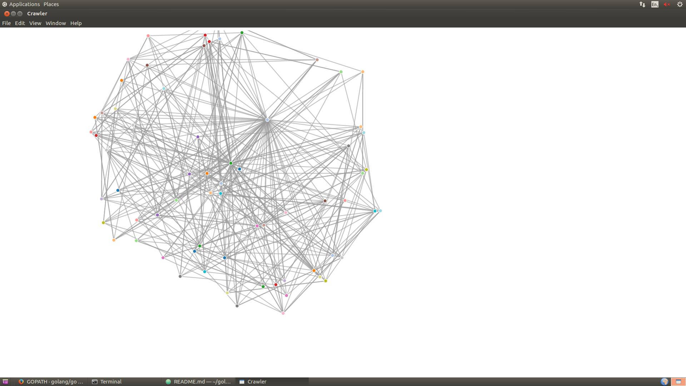

#### Dependencies
To install the application you have to have `$GOPATH/bin` and `$GOROOT/bin` in your $PATH.
```
export GOPATH=$HOME/golang
export PATH=$PATH:$GOROOT/bin:$GOPATH/bin
```

Moreover, you need to have the `NPM` package manager installed.

#### Installation
To install the application run:
```
chmod +x install.sh
./install.sh
```

#### Usage
To use the application you need to do:
```
chmod +x run.sh
./run.sh <name_of_the_site_to_crawl>
```

*Note: The application uses port 30000 by default and will kill any process running there via `lsof -ti:30000 | xargs kill -9`*

For example running when running:
```
./run.sh http://tomblomfield.com
```

You should see something like:


To see the name of the links, move the mouse over any vertex in the graph.
